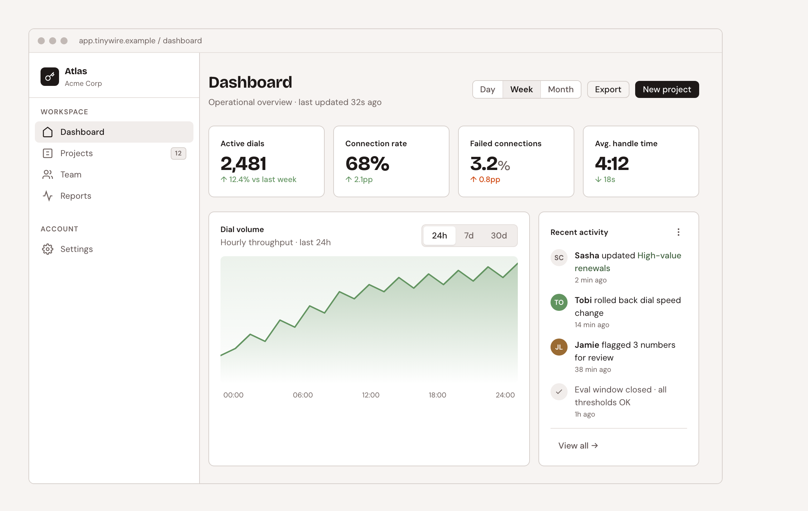

# Tiny Wire

*For: someone who found this on GitHub and wants to know what it is and whether to use it. Taking it into a project: [`lib/CONSUMING.md`](lib/CONSUMING.md). Maintaining it: the [hub](DESIGN-SYSTEM-HUB.md).*

TinyWire is a design system for the interfaces where people operate complex software: dashboards, data tables, and control surfaces. Most of my client work is under NDA, so this is where I show how I approach operator UI. I build prototypes on it and fold what they teach me back in.

**[Live demo & docs →](https://linzlos.github.io/tiny-wire/)** · License: MIT · No build step



<!-- record:counts start -->
- **186 tokens** in `lib/tokens.css`, three tiers (primitive → semantic → component), light and dark
- **30 documented components** on the [components page](docs/components.html) — `lib/components.css` ships 38 class families; 6 have no section yet
- **5 patterns**: Dashboard · Data Table with Filters · Empty states · Login · Settings
<!-- record:counts end -->
- **2 fonts**: Bricolage Grotesque (display) + DM Sans (body)
- **Built-in WCAG checker**: [`docs/a11y.html`](docs/a11y.html) computes live contrast in both themes
- **No framework, no build step**: two stylesheet links and go

The three counts above are rendered from `lib/` and the docs pages by `scripts/render-readme.py`, which also lists anything shipped that the docs don't show yet. Hand edits between the markers are overwritten.

## Quick start

For a plain HTML page. Building a React or Tailwind app? Take `tokens.css` only — [`lib/CONSUMING.md`](lib/CONSUMING.md#two-profiles) says why.

1. Add the fonts to your `<head>`:

```html
<link rel="preconnect" href="https://fonts.googleapis.com">
<link href="https://fonts.googleapis.com/css2?family=Bricolage+Grotesque:wght@400..700&family=DM+Sans:wght@400..600&display=swap" rel="stylesheet">
```

2. Link the stylesheets:

```html
<link rel="stylesheet" href="lib/globals.css">
<link rel="stylesheet" href="lib/components.css">
```

3. Use the components:

```html
<button class="btn btn-primary">Apply changes</button>

<div class="card">
  <div class="card-title">Section title</div>
  <p class="card-desc">Card content.</p>
</div>
```

4. Enable dark mode:

```js
document.documentElement.setAttribute('data-theme', 'dark');
```

## What's in `lib/`

One table, one home: [`lib/CONSUMING.md` § The lib unit](lib/CONSUMING.md#the-lib-unit). Every class the system ships, with a live example: the [components page](docs/components.html).

## Rebranding

Every component reads from CSS custom properties. To rebrand, override the tokens — never touch the component CSS.

```css
/* Override at any scope */
.brand-acme {
  --brand:       #0066CC;
  --brand-fg:    #FFFFFF;
  --brand-light: #E6F0FB;
  --brand-dark:  #003D7A;
}
```

## Contributing

Contributions welcome — new components, variants, fixes, accessibility improvements. The one hard rule: components read **tokens**, never hardcoded values (a CI check enforces it). See **[CONTRIBUTING.md](CONTRIBUTING.md)** for the workflow and **[CODE_OF_CONDUCT.md](CODE_OF_CONDUCT.md)** for community expectations.

## License

[MIT](LICENSE) © 2026 Lindsay Zuniga ([@LinzLos](https://github.com/LinzLos)). Use it, fork it, ship it.
